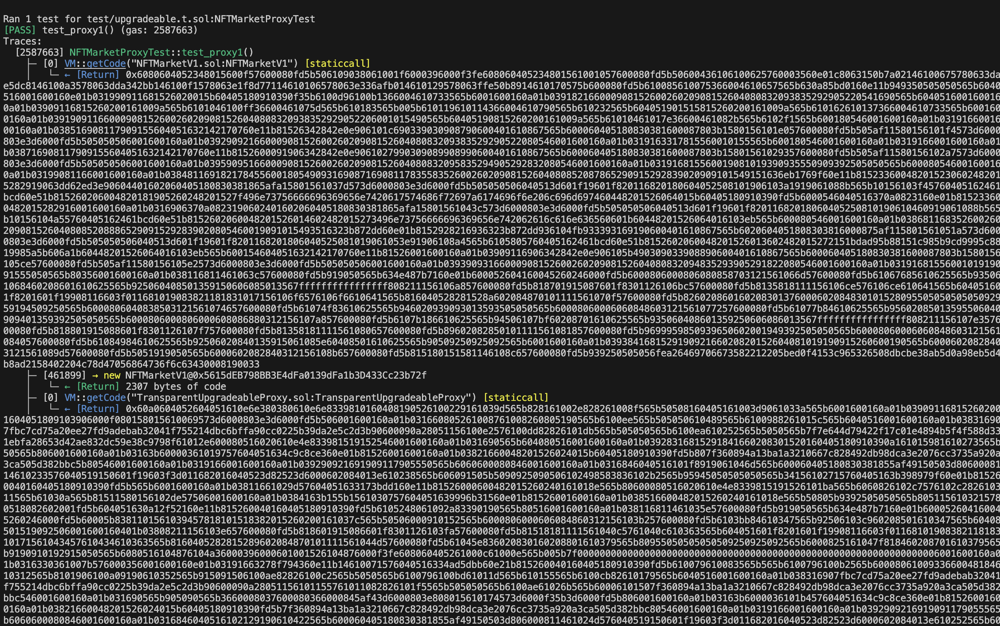
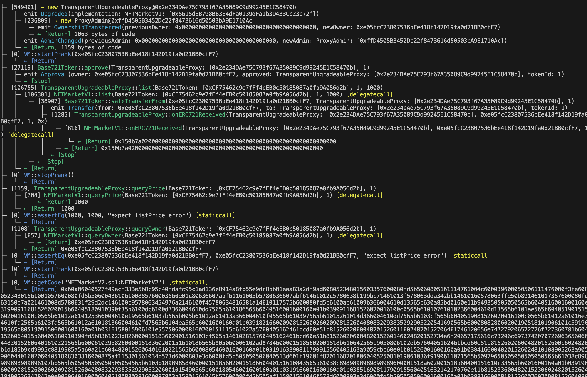
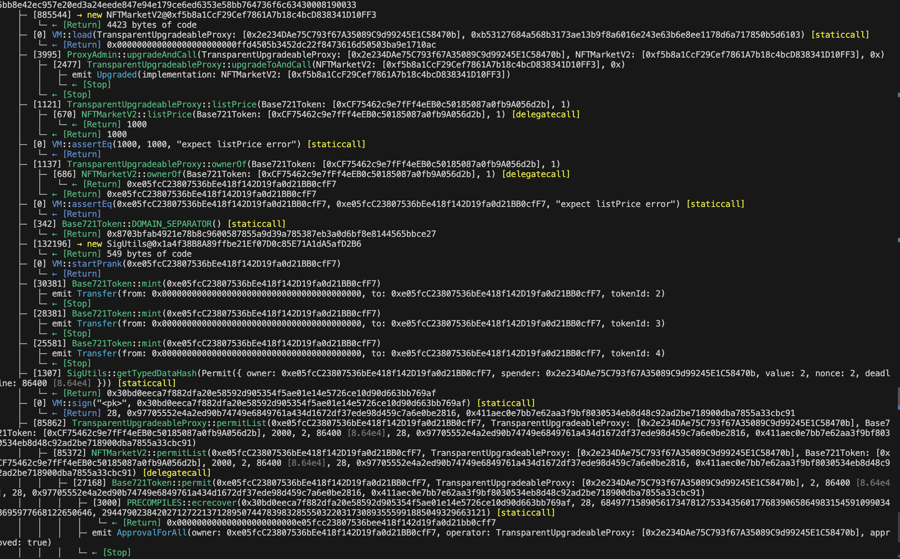
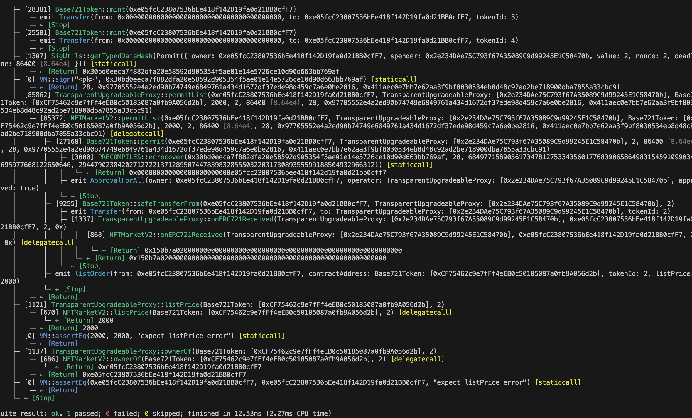

<!-- #NFTMarketV1: 0xCB8b105f6035ffDb17f8c39C9C512F01CC1EadbF
#NFTMarketV2: 0xc58686540b9A1162f5F121a46a6C82feb5FF5c89
#NFTMarketProxy:0xea3F8298036296a29e8c0c0C8F34D81dBaFcD97A -->

# 编写一个可升级的 NFT Market 合约

实现⼀个可升级的 NFT 市场合约： 
• 实现合约的第⼀版本和这个挑战 的逻辑一致。 
• 逻辑合约的第⼆版本，加⼊离线签名上架 NFT 功能⽅法（签名内容：tokenId， 价格），实现⽤户⼀次性使用 setApproveAll 给 NFT 市场合约，每个 NFT 上架时仅需使⽤签名上架。 

部署到测试⽹，并开源到区块链浏览器，在你的 Github 的 Readme.md 中备注代理合约及两个实现的合约地址。 

### 要求： 

包含升级的测试用例（升级前后的状态保持一致） 
包含运行测试用例的日志。 

---

## ‼️ 部署合约地址： 

| 名称                        |                    地址                    |
| :-------------------------- | :----------------------------------------: |
| NFTMarketV1                 | 0x4E77Dbb4E376B5035A7D31cF264716948Cd6E0C1 |
| NFTMarketV2                 | 0x606d1d5a032053555979bc5cae188ab86E0b9430 |
| TransparentUpgradeableProxy | 0xE51D179eD956500AC8E0dd535DDaf48775aD7832 |
| ProxyAdmin                  | 0xf0ef80bbe68320bac7358346b86c9286f03fabc4 |

## ‼️ 测试合约脚本

[test/upgradeable.t.sol](test/upgradeable.t.sol)

## ‼️ 部署合约脚本

[script/NFTMarketUpgradeV1.s.sol](script/NFTMarketUpgradeV1.s.sol)

## ‼️ 升级合约脚本

[script/NFTMarketUpgradeV2.s.sol](script/NFTMarketUpgradeV2.s.sol)

## ‼️ 测试合约日志截图

 

