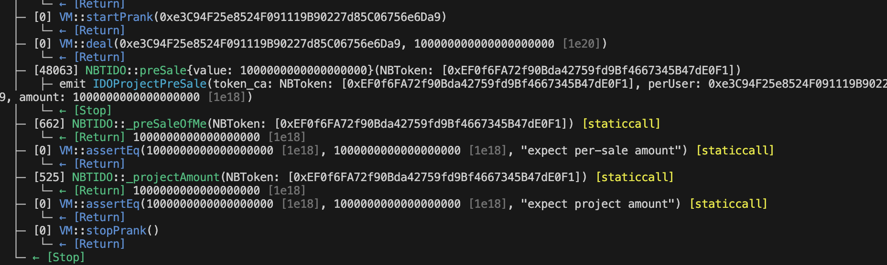
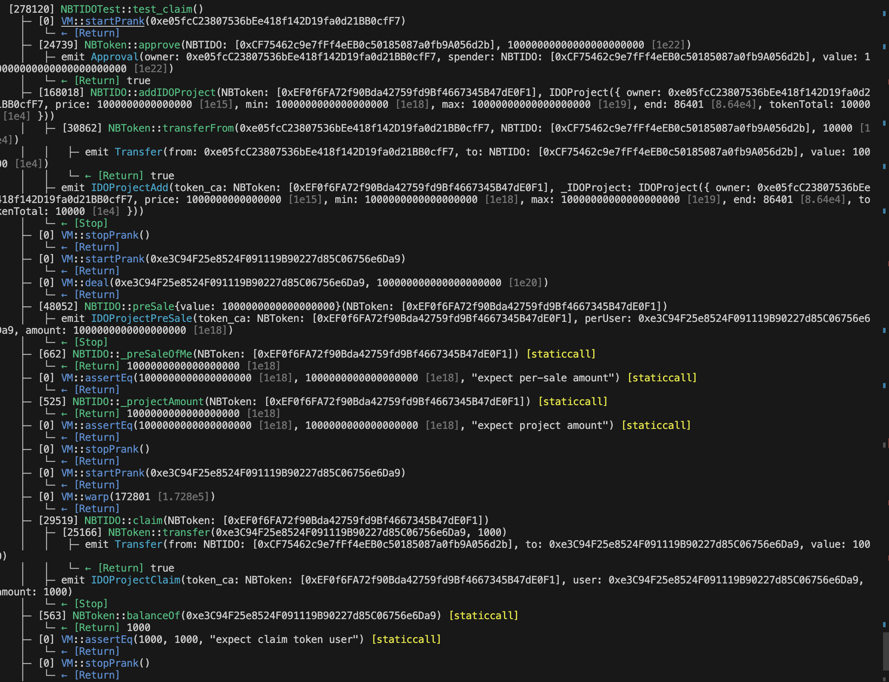
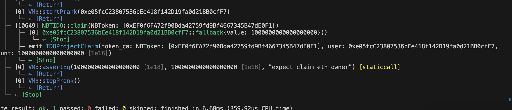
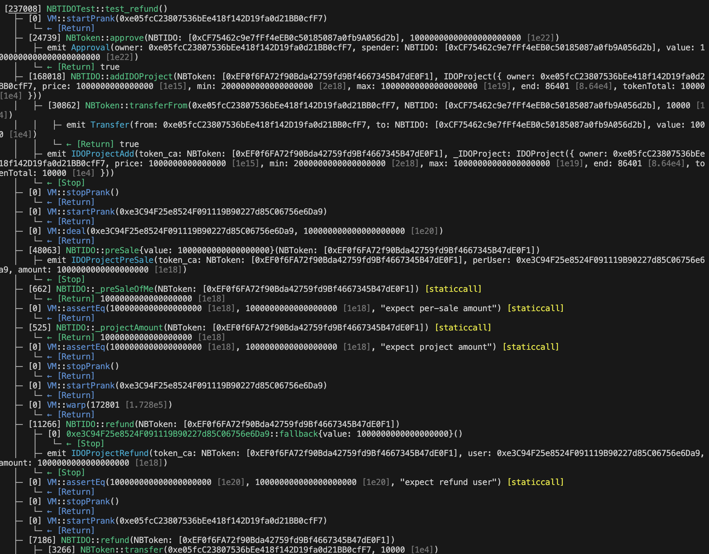
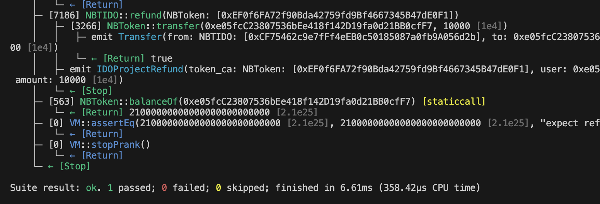

 

---

# 编写IDO募集ETH发行Token

## 编写 IDO 合约，实现 Token 预售，需要实现如下功能：

### 1.开启预售: 支持对给定的任意ERC20开启预售，设定预售价格，募集ETH目标，超募上限，预售时长。
### 2.任意用户可支付ETH参与预售；
### 3.预售结束后，如果没有达到募集目标，则用户可领会退款；
### 4.预售成功，用户可领取 Token，且项目方可提现募集的ETH；

## 提交要求

### 1.编写 IDO 合约 和对应的测试合约
### 2.截图 foundry test 测试执行结果
### 3.提供 github IDO合约源码链接

---

## ‼️ 测试合约脚本
[IDO测试脚本](test/NBTIDO.t.sol)

---
## ‼️ 测试合约日志截图

#### 测试添加项目到IDO
 

#### 测试投资预售

#### 募集成功募资者以及投资者提取收益测试

#### 募资失败募资者与投资者返还投资测试

