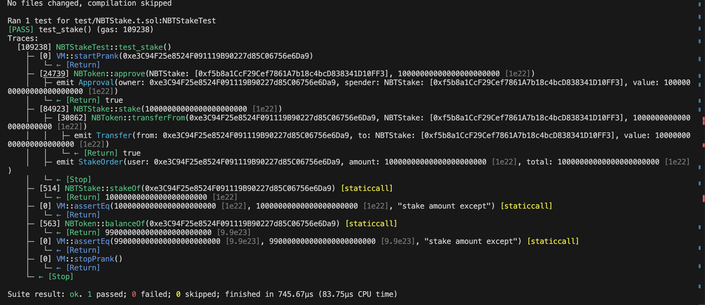
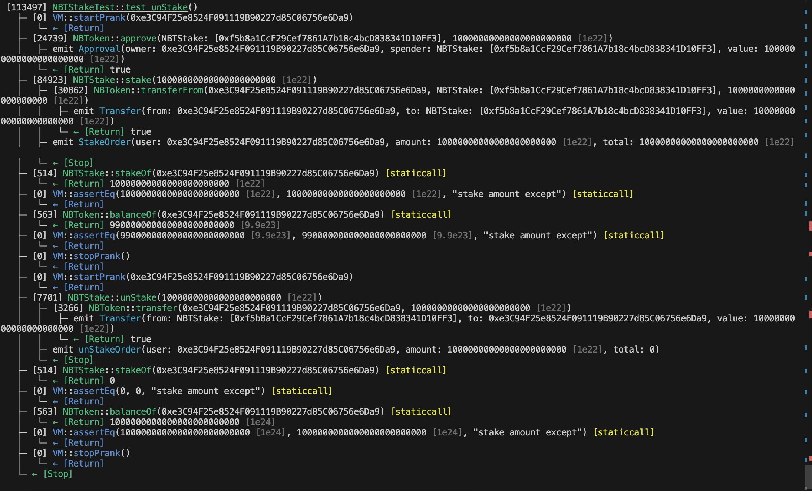
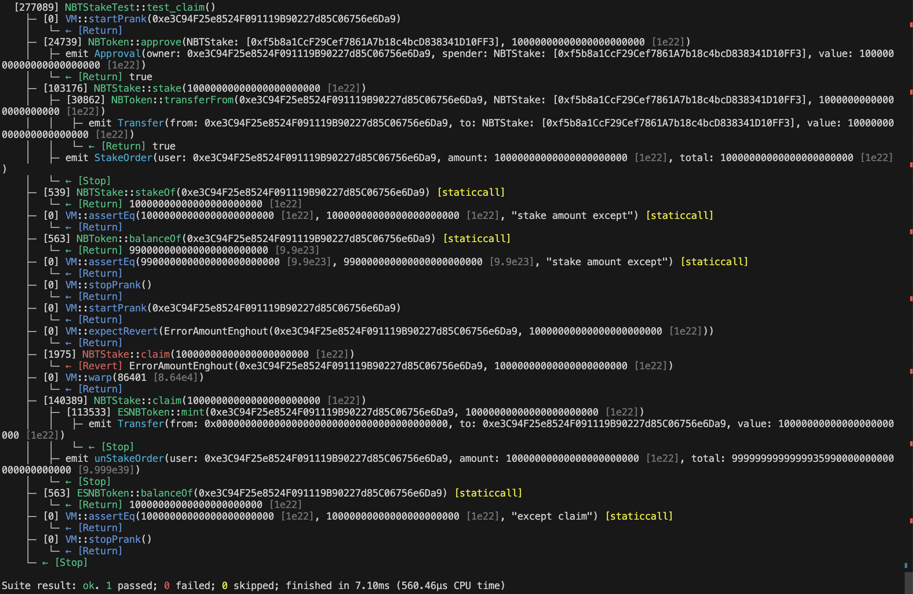
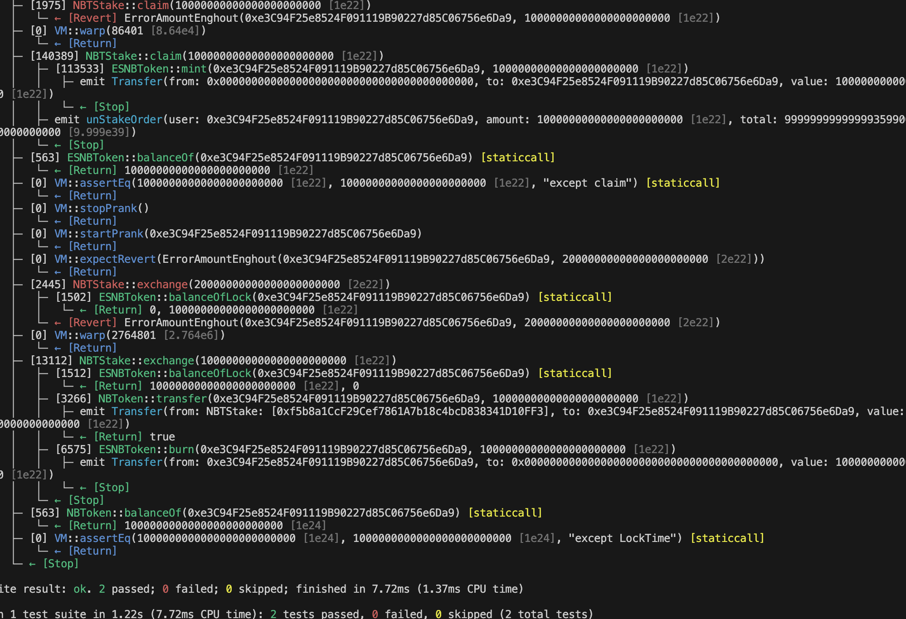
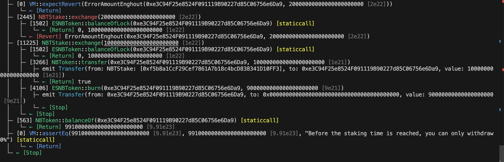

 

---

# 编写一个质押挖矿合约，实现如下功能：

## 1,用户随时可以质押项目方代币 RNT(自定义的ERC20) ，开始赚取项目方Token(esRNT)；
## 2,可随时解押提取已质押的 RNT；
## 3,可随时领取esRNT奖励，每质押1个RNT每天可奖励 1 esRNT;
## 4,esRNT 是锁仓性的 RNT， 1 esRNT 在 30 天后可兑换 1 RNT，随时间线性释放，支持提前将 esRNT 兑换成 RNT，但锁定部分将被 burn 燃烧掉。

---

## ‼️ 测试合约脚本
[Stake测试脚本](test/NBTStake.t.sol)

---
## ‼️ 测试合约日志截图

#### 测试质押

#### 测试解押

#### 测试提取收益

#### 测试兑换已到期Token

#### 测试兑换未到期TOKEN
