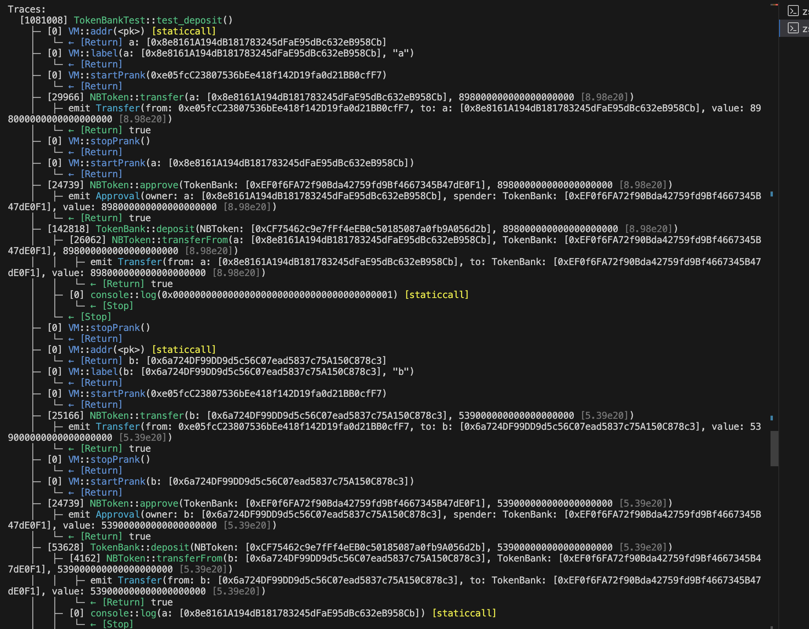
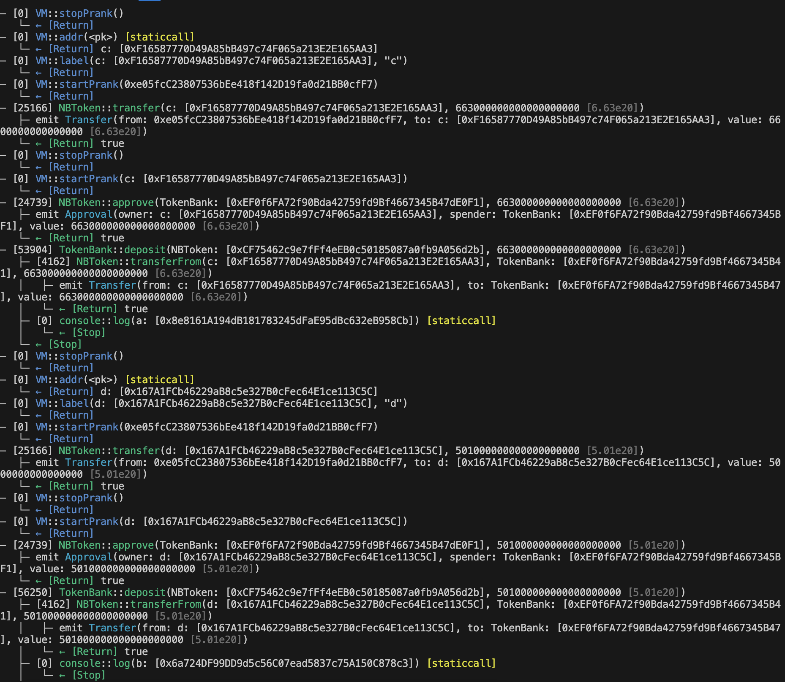
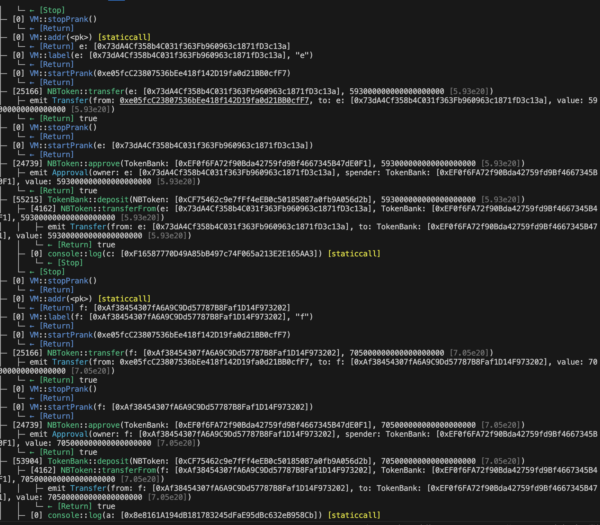
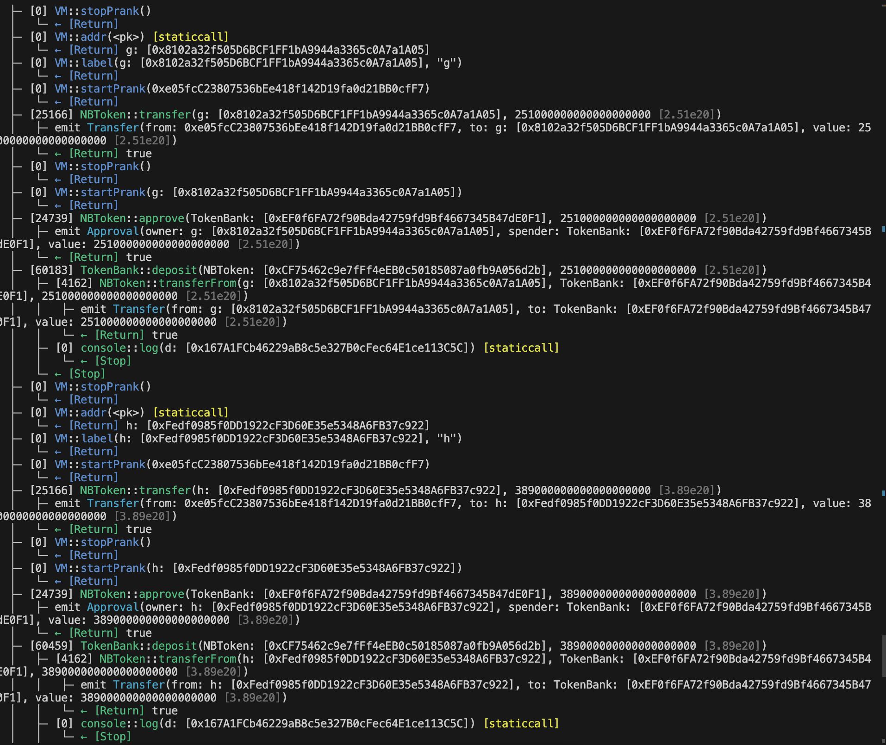
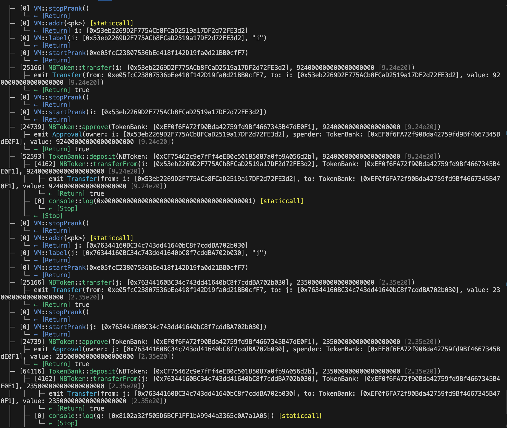
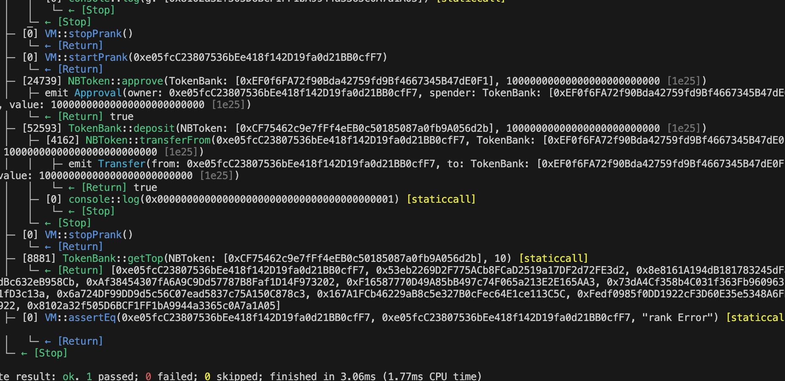
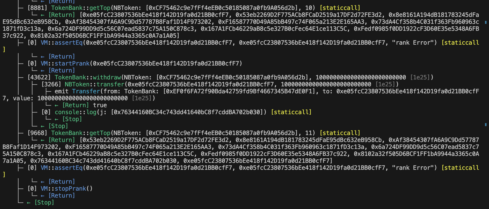

 

---
# 编写一个 Bank 存款合约，实现功能：

## 1.可以通过 Metamask 等钱包直接给 Bank 合约地址存款
## 2.在 Bank 合约里记录了每个地址的存款金额
## 3.用可迭代的链表保存存款金额的前 10 名用户
## 4.请提交你的 github 仓库地址。
---

## ‼️ 测试合约脚本
[测试合约脚本](test/TokenBank.t.sol)

---
## ‼️ 测试合约日志截图

### 测试存款
#### ‼️(测试逻辑随机生成10人进行1-1000随机存款，最后第11人使用Alice进行存款存入最大值，获取排行榜，Alice需要排在第一名)

### 测试取款
#### ‼️(测试逻辑随机生成10人进行1-1000随机存款，最后第11人使用Alice进行存款存入最大值，使用Alice取款存入全部金额，获取前11名排行版，alice需要在最后一名，存款使用上个测试用例逻辑)
